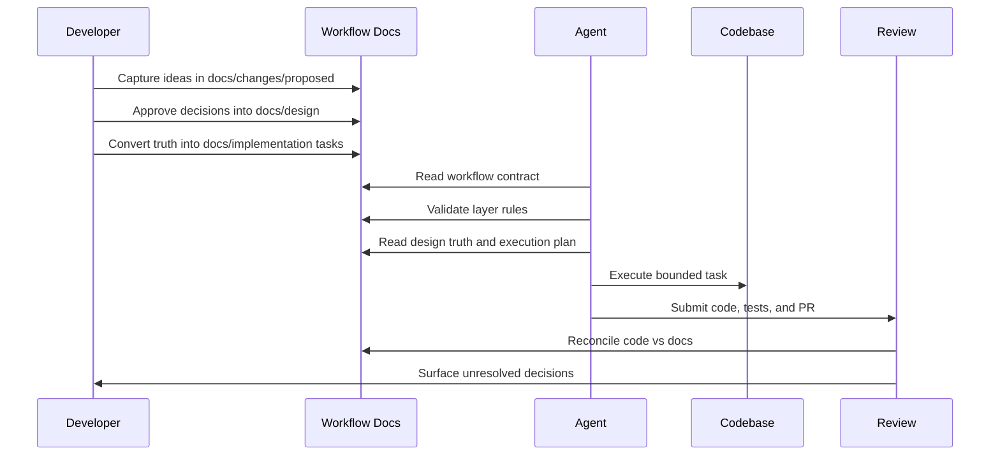
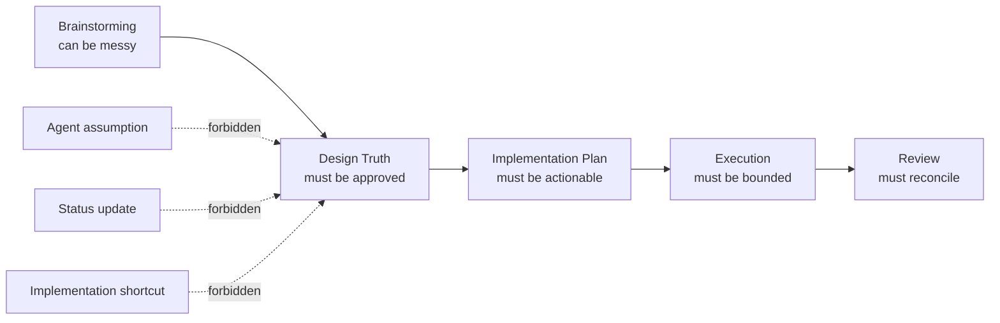

# Workflow Contract

Portable workflow policy for planning-first, source-of-truth-driven engineering.

It helps teams and agents work from clear design truth instead of ad-hoc prompts, scattered notes, or hidden assumptions.

## Why This Exists

Agents can move fast, but speed without structure creates drift.

Common failure modes:

- implementation starts defining behavior
- status updates become pseudo-specs
- brainstorming notes are treated as approved decisions
- agent assumptions silently become system behavior

Workflow Contract prevents this by separating **unresolved thinking**, **approved truth**, **execution planning**, and **implementation** into clear layers.

The goal is simple:

> Faster execution, clearer decisions, and more trustworthy engineering.

## Operating Model

This workflow is a **truth pipeline**.

Humans lead the high-judgment work: framing, research, tradeoffs, decisions, and review.

Agents help structure documentation, execute planned work, validate workflow rules, and keep implementation aligned with approved truth.

Read more on this thought process: https://gist.github.com/astrojose/013efbabaf70b7d39c085b0b0fe75063

| Layer | Name | Purpose | Output |
|---|---|---|---|
| 0 | Change Intake / Discovery | Brainstorm, research, explore options, capture proposals | `docs/changes/proposed/*` |
| 1 | Design Authority | Approved product, system, API, data, and architecture truth | `docs/design/*` |
| 2 | Execution Planning | Roadmap, phases, tasks, status, sequencing | `docs/implementation/*` |
| 3 | Execution | Code, tests, migrations, evals, PRs | Codebase changes |
| 4 | Review / Reconciliation | Compare code vs docs, detect drift, update truth/plans/proposals | Review notes + doc updates |

Core rule:

> Ideas do not become truth by being written.
> Truth exists only after approval.
> Agents execute approved truth, not unresolved thinking.

## Agentic Engineering Flow



## Forbidden Drift



## New Project Setup

Run from the new repository root:

```bash
npx @jerrylusato/agents-setup init --workflow workflow-contract --yes
```

Plain `agents-setup init` only creates agent wiring and does not create `docs/`.

The workflow setup command downloads this private workflow from authenticated GitHub release assets, installs the workflow, and then creates the workflow-owned docs scaffold:

```text
.agents/skills/workflow-contract/
.agents/workflows/workflow-contract/
```

Manual fallback:

```bash
git submodule add git@github.com:iPFSoftwares/workflow-contract.git .agents/workflows/workflow-contract
make -C .agents/workflows/workflow-contract check
```

Then review `AGENTS.md` and add the workflow snippet below when needed.

## What `make check` Does

`make check` bootstraps and validates the workflow contract.

It:

- creates missing workflow docs structure
- creates or repairs local skill links
- links `CLAUDE.md` to `AGENTS.md`; it does not create `GEMINI.md`
- validates structure, metadata, transitions, and references

It does not:

- edit an existing `AGENTS.md`
- decide repo-specific design truth
- replace review of `repo.config.json`

After bootstrap, review:

- `.agents/workflows/workflow-contract/repo.config.json`
- `AGENTS.md`

Done when:

- `AGENTS.md` contains `Workflow Authority` and `Start Here`
- `.agents/workflows/workflow-contract/repo.config.json` has the correct repo name
- `python3 .agents/workflows/workflow-contract/scripts/validate_workflow.py` ends with `WORKFLOW:ok`

## AGENTS.md Setup

Add this to the consuming repo:

```md
## Workflow Authority

- Canonical workflow policy: `.agents/workflows/workflow-contract/spec/*`
- Canonical validator: `python3 .agents/workflows/workflow-contract/scripts/validate_workflow.py`

## Start Here

1. Classify the task.
2. Run `python3 .agents/workflows/workflow-contract/scripts/validate_workflow.py`.
3. Read `docs/design/`.
4. Read `docs/implementation/`.
5. If behavior is unresolved, read or create `docs/changes/proposed/`.
6. Load required repo skill(s).
7. Inspect target service code before editing.
```

Optional reinforcement:

```md
## Documentation Workflow

Use `$workflow-contract` for:

- design docs
- implementation docs
- backlog, phase, task, and status updates
- proposed changes
- docs-vs-code reconciliation
- workflow validation failures

Layer rules:

- `docs/design/`: approved product/system truth.
- `docs/implementation/`: execution plans, phases, tasks, and status only.
- `docs/changes/proposed/`: unresolved proposals only.

Do not define net-new behavior in implementation docs.
Put unresolved behavior in `docs/changes/proposed` until accepted.
```

## Start Here

1. [Adopt in New Repo](./adopt-new-repo.md)
2. [repo.config Reference](./repo-config-reference.md)
3. [Validator Findings Guide](./validator-findings.md)
4. Policy specs in `spec/`

## Package Contents

- `spec/`: canonical workflow policy, lifecycle, guardrails, and task standard
- `templates/`: reusable document templates
- `scripts/validate_workflow.py`: canonical workflow validator
- `compatibility/`: migration guides and compatibility shims
- `examples/`: example documentation and workflow usage
- `repo.config.json`: repo-level workflow configuration

## Validation

Run from the consuming repo root:

```bash
make -C .agents/workflows/workflow-contract check
```

Script fallback:

```bash
python3 .agents/workflows/workflow-contract/scripts/init_workflow_contract.py
python3 .agents/workflows/workflow-contract/scripts/validate_workflow.py
```

## Update Workflow

1. Make changes in this repo.
2. Build the private release asset:
   ```bash
   python3 scripts/package_workflow_release.py --version <version>
   ```
3. Attach `ipf-workflows-v<version>.tar.gz` to a private GitHub Release.
4. Follow the migration guide in `compatibility/` if the release has breaking changes.
5. Re-run consumer setup or validation.
