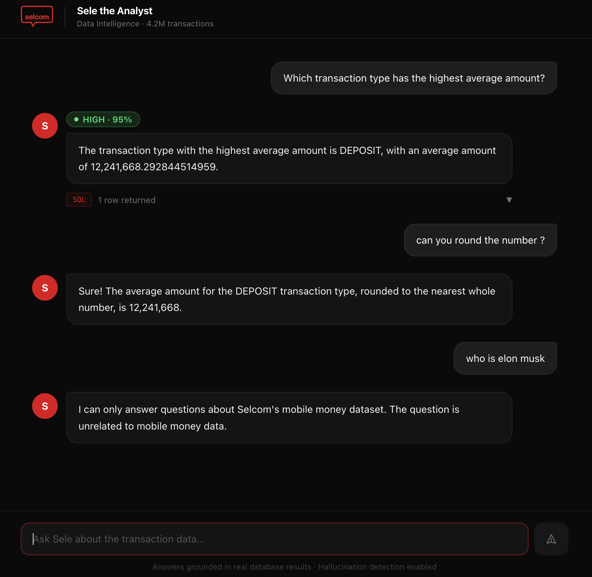

# Sele the Analyst — Selcom Data Intelligence

A complete data engineering system built on **4.2 million** synthetic East African mobile money transactions.

Ask plain-English questions. Get real answers — backed by actual database results, with a confidence score and hallucination detection.

---

## What You Will See

When everything is running, open **http://localhost:3000** in your browser:



Every answer shows:
- A **confidence badge** (HIGH / MEDIUM / LOW) based on hallucination detection
- The **SQL query** that was generated and executed
- A **data preview table** with the actual database results
- A **back-translation check** — the system re-reads its own SQL to verify it answered correctly

---

## Before You Start — What You Need

Install these four things if you do not have them:

| Tool | What it does | Download |
|---|---|---|
| **Docker Desktop** | Runs all 4 services with one command | https://www.docker.com/products/docker-desktop |
| **Git** | Downloads the project code | https://git-scm.com/downloads |
| **OpenAI API key** | Powers the AI question-answering | https://platform.openai.com/api-keys |
| **The dataset CSV** | 4.2M transaction rows (too large for GitHub) | https://www.kaggle.com/datasets/denishazamuke/synthetic-mobile-money-transaction-dataset |

> **No Python or Node.js needed** — Docker handles everything.

---

## Quick Start — 5 Steps

### Step 1 — Download the project

```bash
git clone https://github.com/Godie360/data-engineering-assesment.git
cd data-engineering-assesment
```

### Step 2 — Add your OpenAI API key

Copy the example environment file:

```bash
cp .env.example .env
```

Open the `.env` file in any text editor and replace `sk-...` with your real key:

```
OPENAI_API_KEY=sk-your-actual-key-here
```

Everything else in `.env` can stay as-is.

### Step 3 — Add the dataset

Download **MoMTSim_20240722202413_1000_dataset.csv** from Kaggle and place it here:

```
data-engineering-assesment/
  └── data/
        └── MoMTSim_20240722202413_1000_dataset.csv   ← place it here
```

If the `data/` folder does not exist, create it:

```bash
mkdir data
```

Then move your downloaded file into it.

### Step 4 — Start everything

```bash
docker compose up --build
```

This single command:
1. Starts PostgreSQL and waits until it is healthy
2. Applies the database schema (creates tables and indexes)
3. Loads all 4,225,958 rows into PostgreSQL — watch the progress in the terminal
4. Starts the FastAPI backend (the AI question-answering engine)
5. Starts the Next.js chat interface

**The first run takes about 3–5 minutes** while Docker builds images and the pipeline loads the data.
Subsequent runs (without `--build`) start in under 30 seconds because the data is already loaded.

You will see output like this in the terminal:

```
selcom-pipeline  | [1/3] Applying database schema to PostgreSQL...
selcom-pipeline  |       ✓ Tables ready
selcom-pipeline  | [2/3] Loading data — 4,225,958 rows across 43 chunks
selcom-pipeline  |   chunk  1/43  2.3%  │  loaded:   100,000  │  46,201 rows/s
selcom-pipeline  |   chunk  2/43  4.7%  │  loaded:   200,000  │  47,885 rows/s
selcom-pipeline  |   ...
selcom-pipeline  | [3/3] Computing transaction_summary table...
selcom-pipeline  |       ✓ 45 summary rows computed
selcom-api       | INFO:     Uvicorn running on http://0.0.0.0:8000
selcom-frontend  |   ✓ Ready in 2.1s
```

### Step 5 — Open the chat

Open your browser and go to:

```
http://localhost:3000
```

Start asking questions about the data.

---

## What to Ask Sele

Copy and paste any of these to get started:

```
Give me an overview of this data
What is the total value of fraudulent transfers?
What percentage of TRANSFER transactions are fraudulent?
Which transaction type has the highest average amount?
What is the busiest hour for transaction volume?
Show fraud rate by transaction type
Compare total deposits vs total withdrawals
Which day had the highest number of fraudulent transactions?
What is the largest single fraudulent transaction?
Show balance errors by transaction type
How many unique merchant accounts received payments?
What is the net money flow per simulation day?
```

You can also ask follow-up questions after any answer:
- "What do you mean by hour 0?"
- "Is that fraud rate normal?"
- "Explain that result"

---

## Watching the Pipeline Load (Optional)

To see only the data loading progress in a separate terminal:

```bash
docker compose logs pipeline -f
```

To see the API handling requests:

```bash
docker compose logs api -f
```

To stop everything:

```bash
docker compose down
```

---

## Troubleshooting

| Problem | Fix |
|---|---|
| `docker compose` command not found | Make sure Docker Desktop is running (open the app) |
| Port 3000 already in use | Stop whatever is using port 3000, or change `"3000:3000"` to `"3001:3000"` in `docker-compose.yml` |
| Port 5433 already in use | Change `"5433:5432"` to `"5434:5432"` in `docker-compose.yml` and update `POSTGRES_PORT=5434` in `.env` |
| `chatbot-ui` never starts | The pipeline must finish first. Wait for the `PIPELINE COMPLETE` message. |
| `selcom-api` unhealthy | Wait 30–60 seconds after the pipeline finishes — the API needs time to start |
| CSV file not found | Make sure the file is inside the `data/` folder with the exact filename from Kaggle |
| OpenAI error | Double-check your API key in `.env` — make sure there are no spaces or quotes around it |
| Answer says "I can only answer questions about..." | The question is out of scope. Try one of the sample questions above. |

---

## How It Works

```
You type a question
        │
        ▼
[LangGraph] classifies: data question or follow-up?
        │
        ├─ Follow-up ──► AI explains in plain English
        │
        └─ Data question
                │
                ▼
        [GPT-4o-mini] writes a PostgreSQL SQL query
                │
                ▼
        [Validator] checks the SQL is safe (SELECT only, read-only transaction)
                │
                ▼
        [PostgreSQL] executes against 4.2M rows
                │
                ▼
        [Hallucination check] re-reads the SQL: "Does this actually answer the question?"
                │
                ▼
        [GPT-4o-mini] writes a grounded answer using only the real results
                │
                ▼
        You see the answer + confidence score + SQL + data preview
```

---

## Architecture

```
docker compose up
       │
       ├── selcom-postgres    PostgreSQL 15 — stores all transaction data (port 5433)
       │
       ├── selcom-pipeline    Python — loads 4.2M rows, builds summary table (exits after)
       │
       ├── selcom-api         FastAPI — receives questions, runs the AI pipeline (port 8000)
       │
       └── chatbot-ui         Next.js — the chat interface you see in your browser (port 3000)
```

Services start in this exact order. Each waits for the previous to be healthy before starting.

---

## All Dependencies

All dependencies are managed by Docker — you do not need to install Python packages or Node modules manually.

**Python (backend):**

| Package | Version | Purpose |
|---|---|---|
| pandas | >=2.0.0 | Chunked CSV reading and transformation |
| psycopg2-binary | >=2.9.0 | PostgreSQL connection and COPY bulk insert |
| openai | >=1.0.0 | GPT-4o-mini API for SQL generation and responses |
| langgraph | >=0.2.0 | Conversation state management and graph routing |
| langchain-core | >=0.3.0 | Message types for LangGraph memory |
| fastapi | >=0.110.0 | REST API server |
| uvicorn | >=0.29.0 | ASGI server for FastAPI |
| sqlparse | >=0.4.4 | SQL syntax validation |
| python-dotenv | >=1.0.0 | Environment variable loading |
| tqdm | >=4.65.0 | Progress bar during pipeline load |

**Frontend:**

| Package | Purpose |
|---|---|
| Next.js 15 | React framework for the chat UI |
| React 19 | UI components |
| Tailwind CSS | Styling |
| react-markdown | Renders markdown in chat responses |

---

## Environment Variables

All configured in `.env`. Only `OPENAI_API_KEY` is required — everything else has defaults.

| Variable | Default | Description |
|---|---|---|
| `OPENAI_API_KEY` | *(required)* | Your OpenAI API key |
| `POSTGRES_HOST` | `127.0.0.1` | Database host |
| `POSTGRES_PORT` | `5433` | Host port for PostgreSQL |
| `POSTGRES_DB` | `selcom_assessment` | Database name |
| `POSTGRES_USER` | `selcom` | Database user |
| `POSTGRES_PASSWORD` | `selcom_pass` | Database password |

---

## Project Structure

```
├── engine/              Python data pipeline modules
│   ├── loader.py        Chunked CSV reader (100k rows/chunk)
│   ├── cleaner.py       Cleaning and validation rules
│   ├── transformer.py   7 derived analytical columns
│   ├── loader_db.py     PostgreSQL COPY bulk insert
│   └── aggregator.py    Builds the transaction_summary table
│
├── rag/                 AI question-answering pipeline
│   ├── graph.py         LangGraph graph (classify → SQL → execute → validate → answer)
│   ├── state.py         Typed state with conversation memory
│   ├── schema.py        Database schema context + few-shot SQL examples
│   ├── query_gen.py     Natural language → SQL (GPT-4o-mini)
│   ├── executor.py      SQL safety check + read-only execution
│   ├── hallucination.py Back-translation confidence scoring
│   └── response_gen.py  SQL results → grounded natural language answer
│
├── api/
│   └── main.py          FastAPI server (POST /api/chat, GET /health)
│
├── frontend/            Next.js chat interface (Sele the Analyst)
│
├── sql/
│   ├── schema.sql       Database table definitions and indexes
│   └── apply_schema.py  Applies schema to PostgreSQL (idempotent)
│
├── data/                Place your CSV here (git-ignored — too large)
├── run_pipeline.py      Pipeline entry point with progress display
├── Dockerfile           Python backend Docker image
├── docker-compose.yml   Full-stack orchestration (4 services)
├── requirements.txt     Python dependencies
├── .env.example         Environment variable template
└── REPORT.md            Technical approach and design decisions
```

---

*Built for the Selcom Paytech Data Engineer pre-interview assessment — July 2026.*
